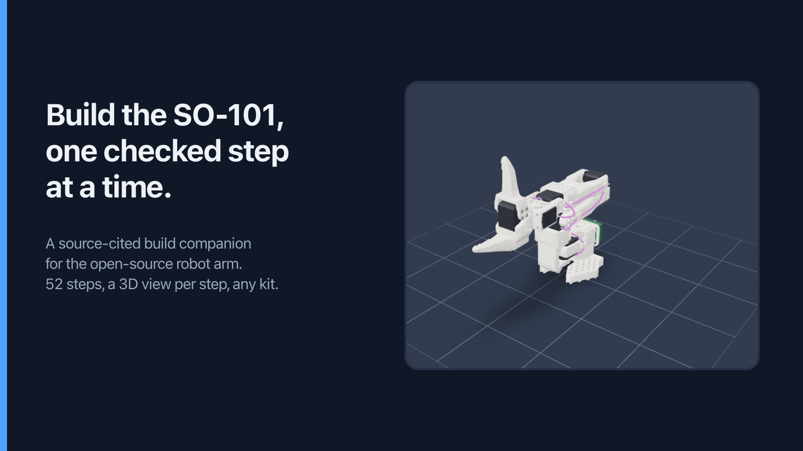
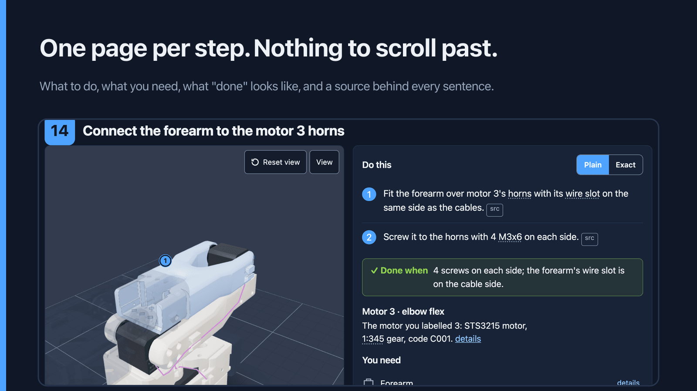
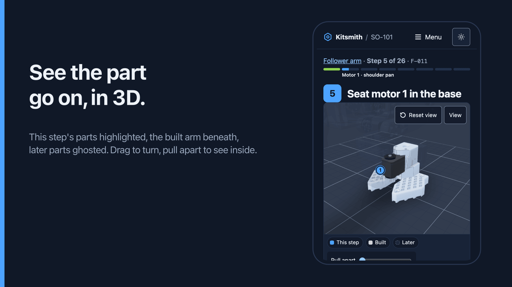
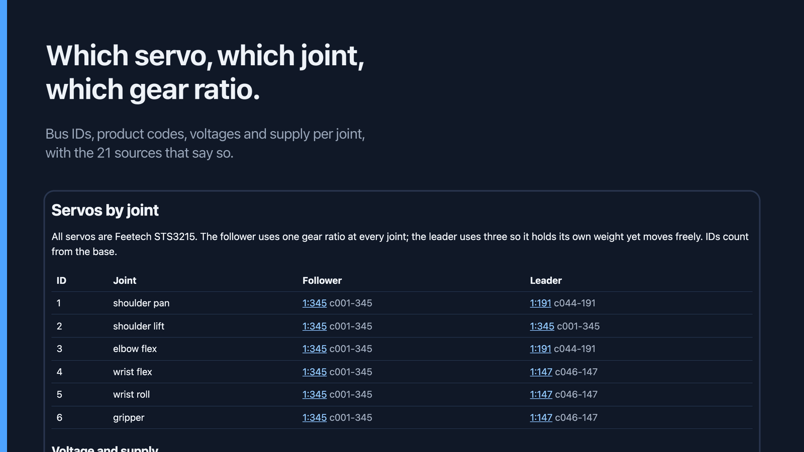
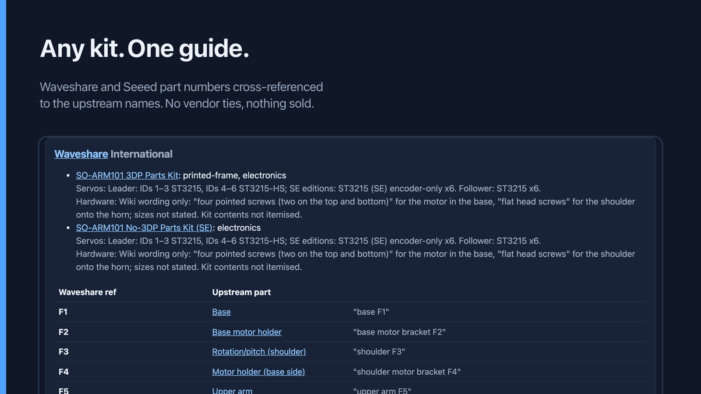
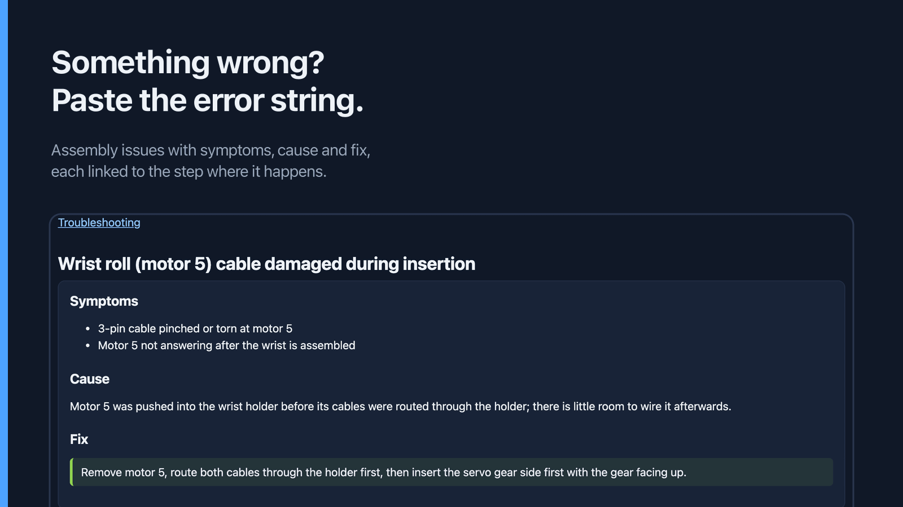

<p align="center">
  <a href="https://kitsmith.dev/so101/"></a>
</p>

# SO-101 interactive assembly guide

**Live at [kitsmith.dev/so101](https://kitsmith.dev/so101/).**

A build companion for the [SO-101](https://github.com/TheRobotStudio/SO-ARM100)
open-source robot arm (TheRobotStudio / Hugging Face LeRobot). One page per
step for the follower and the leader arm: which parts go on, which servo and
gear ratio sits at which joint, which screws and tool, how the cable runs, and
a check to perform before moving on, with a 3D view of the parts going on.

Every fact traces to a public source: a file in the upstream repo at a pinned
commit, the LeRobot page, the Feetech datasheet, or a vendor wiki with a
retrieval date. What no source confirms is marked `unverified` and kept out of
search engines. Where sources disagree, [`data/discrepancies.md`](data/discrepancies.md)
records the disagreement instead of resolving it silently. Not affiliated with
any kit vendor; nothing is sold.

## What you get

<a href="https://kitsmith.dev/so101/follower/032-follower-joint3-forearm/"></a>

<a href="https://kitsmith.dev/so101/follower/011-follower-joint1-motor-into-base/"></a>

<a href="https://kitsmith.dev/so101/servos/"></a>

<a href="https://kitsmith.dev/so101/kits/"></a>

<a href="https://kitsmith.dev/so101/troubleshooting/"></a>

- **52 steps** across both arms, in the upstream order, each with a `check`.
- **Plain and Exact wording.** Plain rewords each step for a first build and
  links glossary terms on first use; Exact is the sourced text.
- **3D view per step.** This step's parts highlighted, the built arm beneath,
  later parts ghosted; drag to turn, pull apart to see inside. Every page is
  complete without it.
- **Reference pages** for every part, servo slot, tool and issue, plus
  print settings, an SO-100 vs SO-101 comparison, kits and an FAQ.
- **Error-string search** that routes to the matching troubleshooting page.
- **Works at the bench:** dark by default, phone layout, resumes where you
  left off, installable, embeddable per step for vendor wikis.

## How it is built

The data model is the product. `data/` holds the parts, servos, fasteners,
tools, steps, glossary, vendors and troubleshooting issues as YAML, validated
by JSON Schema and cross-reference checks on every commit. The site is one
renderer of that data; a printable checklist is another.

- `pipeline/` (Python, cadquery) walks the upstream STEP assembly and exports
  one GLB per part plus the placements the 3D view uses.
- `viewer/` (Astro) pre-renders one static HTML page per step, part, servo
  slot, tool and issue from the compiled data; the React Three Fiber viewer is
  a client island that loads only the meshes a step needs.
- A build fails loudly on a schema violation, a part in geometry without a
  BOM id, a step referencing an unknown part, or a missing source.

Design decisions are recorded in [`docs/adr/`](docs/adr) and phase reports in
[`docs/phases/`](docs/phases). The rules the project holds itself to are in
[CLAUDE.md](CLAUDE.md).

```
data/        YAML source of truth + JSON Schemas; discrepancies.md
upstream/    pinned upstream repos
pipeline/    STEP/STL -> GLB + placements.json (uv)
viewer/      Astro pages + React Three Fiber island (pnpm)
scripts/     validate, build-data, export-checklist
deploy/      nginx vhost and the release script for kitsmith.dev
docs/        thesis, ADRs, phase reports, upstream issue drafts
SOURCES.md   every external asset, its licence, where it lives here
```

## Corrections welcome

Built one and found a step that is wrong for your kit? Open an issue with the
step id (for example `F-032`), what you saw, and a public source if you have
one: a vendor wiki page, a GitHub issue, a video timestamp. Fixes to `data/`
land with their source; a claim without one is recorded as `unverified`, not
dropped.

## Develop

```sh
pnpm install                    # JS workspaces (scripts, viewer)
pnpm validate --flags           # schema + cross-reference checks; lists unverified/approximation flags
pnpm build                      # data -> viewer/src/generated/data.json -> viewer/dist
pnpm dev                        # Astro dev server (run pnpm build-data first)
uv run --directory pipeline pytest
uvx pre-commit install          # ruff, prettier, schema validation on commit
```

Node 22+, pnpm 10, uv. CI runs the same validation, the pipeline tests and a
Lighthouse audit on every pull request. A merge to `main` builds the site in
Actions and releases it to kitsmith.dev; the server side is under
[`deploy/`](deploy).

## Licence

Code and data files: MIT (see [LICENSE](LICENSE)). Upstream assets keep their
own licences and attribution: the SO-101 design is Apache-2.0 by
TheRobotStudio; see [SOURCES.md](SOURCES.md) for every external asset.
